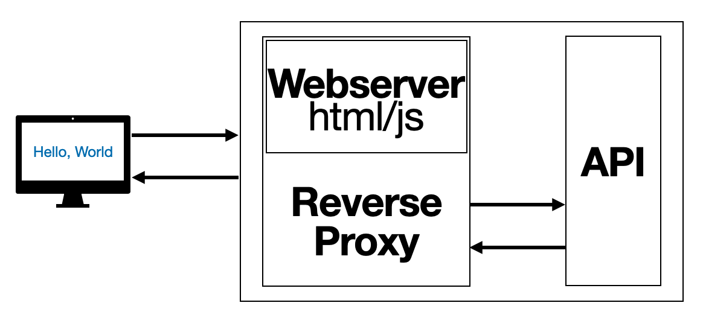
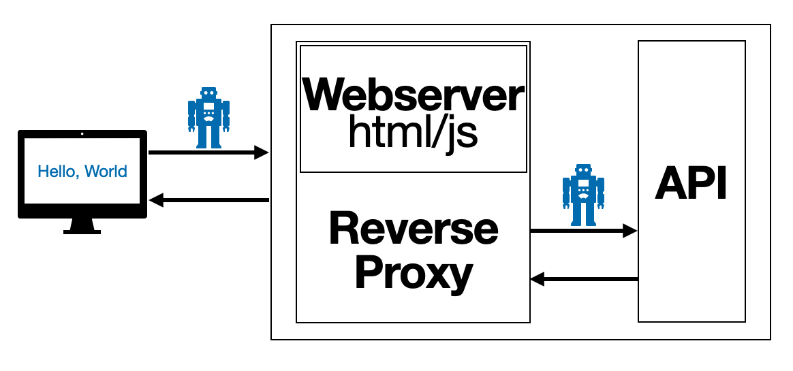

# Development Workflow

1. API: install dependencies

   ```sh
    cd api
    npm install
   ```

2. API: analyze

   ```sh
    cd api
    npx eslint .
   ```

3. API: test

   ```sh
    cd api
    npm test
   ```

4. UI: install dependencies

   ```sh
   cd ui
   npm install
   ```

5. UI: analyze

   ```sh
   cd ui
   npx eslint src/*.js
   ```

6. UI: test

   ```sh
   cd ui
   CI=true npm test
   ```

7. UI: build

   ```sh
   cd ui
   docker build -t web:v0.0.1 .
   ```

8. API: build

   ```sh
   cd api
   docker build -t api:v0.0.1 .
   ```

9. Start docker compose

   ```sh
   docker compose up -d
   ```

10. Run API: acceptance test

    ```sh
    cd atdd/api/
    robot api.robot
    ```

11. Run UI: acceptance test

    ```sh
    cd atdd/web/
    robot ui.robot
    ```

12. Stop docker compose

    ```sh
    docker compose down
    ```

---

## Overview

- System Overview



- System Overview With Tests


